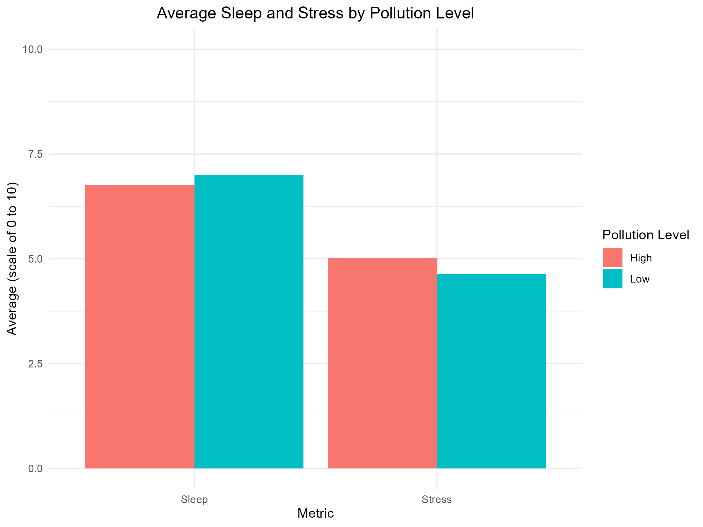

# 🌍 Impact of Air Pollution on Mental Health: A Data Analysis Case Study  

---

## 🔍 Overview  
This project investigates the relationship between **air pollution (NO₂ levels)** and **mental health indicators, such as sleep quality and duration**, using data from **Barcelona**.  

The analysis was conducted in **two phases**:  
1. **Initial version in Google Sheets** for basic data cleaning and visualization  
2. **Enhanced analysis in R** for advanced statistical insights and improved visualizations  

---

## 🎯 Objectives  
- Analyze air pollution levels and their correlation with sleep duration  
- Compare mental health patterns in high vs. low NO₂ concentration days  
- Explore how data visualization improves decision-making and storytelling  

---

## ✅ Key Insights  
- Higher **NO₂ levels** correlate with **shorter sleep duration**  
- Days with **elevated pollution** show a potential link to **lower mental well-being**  
- R-based analysis provided **clearer patterns** compared to the initial Google Sheets version  

---

## 🛠 Tech Stack  
  
  

---

## 📂 Project Structure  
- **/data**: Initial dataset (Impact_Air-Pollution_on_Mental-Health_AnalysisV1)  
- **analysis.R**: R script for cleaning and visualization  
- **visualizations/**: PNG charts created in R  
- **README.md**: Project documentation  

---

## 📊 Analysis Phases  
### **Phase 1 – Google Sheets**  
- Performed **data cleaning**, removed inconsistencies, handled missing values  
- Created **pivot tables and charts** for initial exploratory analysis  
- [Impact_Air-Pollution_on_Mental-Health_AnalysisV1](https://docs.google.com/spreadsheets/d/1l04DSKw9kZwAJBKQGaKQeLCNJmh-RMRSU56GCbGP2Kw/edit?gid=506892392#gid=506892392)  

### **Phase 2 – R Analysis**  
- Used **dplyr** for data wrangling  
- Created **scatter plots** and trend lines to examine correlations  
- Exported visualizations as `.png` for sharing  

---

## ⚠️ Challenges & Solutions  
- **Challenge**: Data inconsistencies across sources  
- **Solution**: Standardized format in Google Sheets before loading into R  

---

## 📈 Key Visualization  

---

## ✅ Conclusion
Air pollution (NO₂) appears to have a measurable impact on sleep duration, which can influence mental well-being. Further studies with larger datasets are recommended.

---

## 🚀 Next Steps  
- Expand analysis using **SQL** for advanced queries  
- Build a **Tableau dashboard** for interactive data storytelling  
- Integrate additional environmental and behavioral variables for deeper insights  

---

## 📚 References 
- Dataset: CitieSHealth Project, provided by Barcelona Institute for Global Health. (https://www.kaggle.com/datasets/thedevastator/air-pollution-and-mental-health?resource=download)
  
---

### ✅ Author  
**Karen Flores** | [LinkedIn](www.linkedin.com/in/karenfloresj) | [GitHub](https://github.com/kjpflores-cell) 

---

## ▶ How to Reproduce
1. Clone this repo
2. Open `analysis_air_pollution.R` in RStudio
3. Load dataset from `/data/`
4. Run the script to generate visualizations

---

